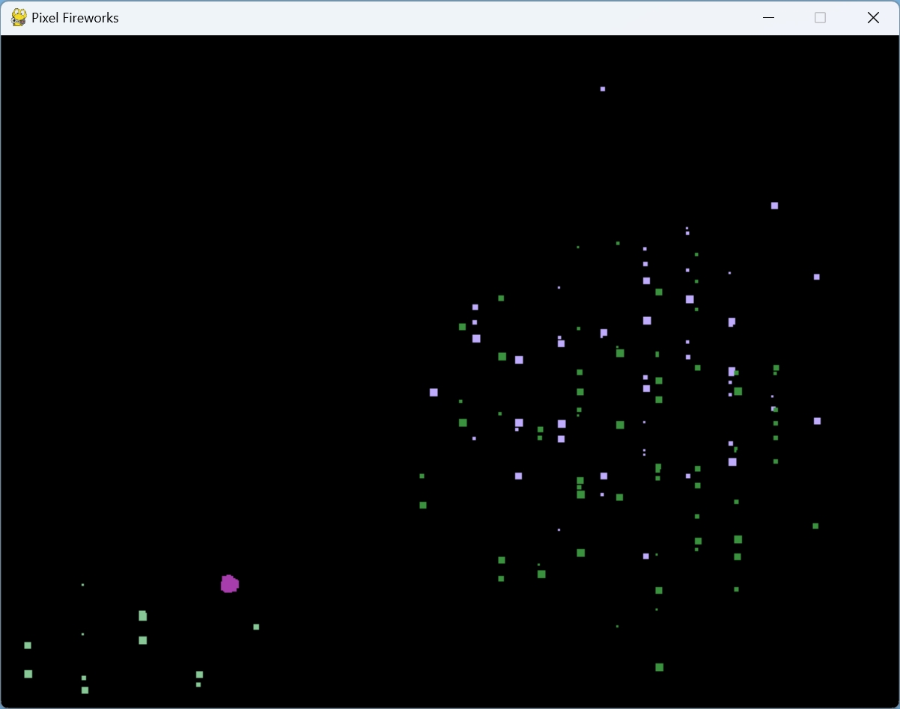
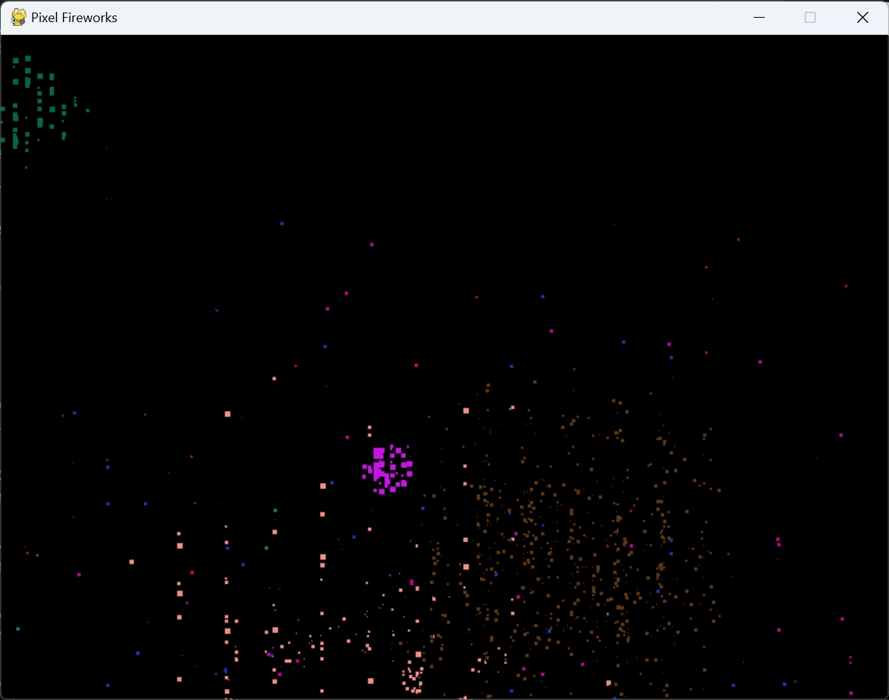
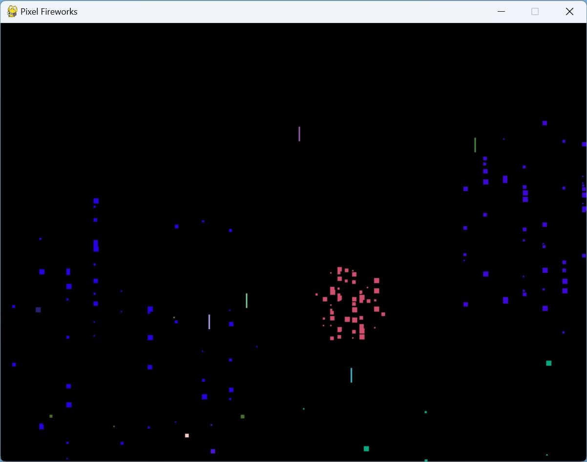

# feuerwerk

### feuerwerk_v1.py: Pixel Fireworks

Dieses Skript erstellt ein einfaches Feuerwerkssimulationsspiel mit Pixeln.

1. Es initialisiert die Pygame-Bibliothek, um ein Fenster zu erstellen und die Spiellogik zu steuern.
2. Es definiert eine Klasse `Pixel`, die für die Bewegung und das Verschwinden der Pixel verantwortlich ist. Jeder Pixel hat eine zufällige Farbe und fällt aufgrund der Gravitation nach unten.
3. Die Klasse `Explosion` erstellt eine Gruppe von Pixeln, die in einem zufälligen Winkel und einer zufälligen Geschwindigkeit explodieren.
4. In der Haupt-Loop des Spiels werden Explosionen erzeugt, wenn eine zufällige Bedingung erfüllt ist, und alle Explosionen sowie Pixel aktualisiert und gezeichnet.

Unterschiede von Skript 1 zu den anderen Skripten:
- Es gibt keine Subpixel oder Raketen.
- Explosionen bestehen aus einer Gruppe von Pixeln, die in zufälligen Winkeln explodieren.

### feuerwerk_v2.py: Pixel Fireworks mit Subpixeln

Dieses Skript erweitert das vorherige Feuerwerksspiel, indem es Subpixel einführt, die aus den Hauptpixeln explodieren.

1. Es definiert eine neue Klasse `SubPixel`, die ähnlich wie `Pixel` funktioniert, aber kleinere Teilchen darstellt.
2. Die Klasse `Pixel` wurde erweitert, um die Methode `explode()` hinzuzufügen, die Subpixel erzeugt, wenn ein Pixel den unteren Rand des Bildschirms erreicht.
3. Es wird eine Gruppe `all_sprites` erstellt, die alle Pixel und Subpixel enthält.
4. Raketen sind in diesem Skript nicht vorhanden.

Unterschiede von Skript 2 zu den anderen Skripten:
- Es gibt Subpixel, die aus den Hauptpixeln explodieren.
- Es gibt keine Raketen.

### feuerwerk_v3.py: Pixel Fireworks mit Raketen

Dieses Skript führt Raketen ein, die aufsteigen und explodieren, um ein komplexeres Feuerwerk zu erstellen.

1. Es definiert eine neue Klasse `Rocket`, die Raketen repräsentiert, die nach oben fliegen und explodieren.
2. Die Klasse `Explosion` wurde angepasst, um die Farbe der Rakete zu übernehmen, und sie erstellt eine Explosion mit Pixeln.
3. In der Haupt-Loop werden Raketen erzeugt, wenn eine zufällige Bedingung erfüllt ist, und die Explosionen und Raketen werden aktualisiert und gezeichnet.

Unterschiede von Skript 3 zu den anderen Skripten:
- Es gibt Raketen, die aufsteigen und explodieren.
- Explosionen werden von Raketen ausgelöst.

### Gemeinsame Punkte und Lerneffekte:

Alle drei Skripte verwenden die Pygame-Bibliothek, um Animationen und Interaktionen im Fenster zu erstellen. Sie zeigen verschiedene Konzepte:

- **Klassen und Vererbung**: Die Verwendung von Klassen und Vererbung in den Skripten ermöglicht eine modulare und gut strukturierte Codebasis.
- **Objektbewegung und Kollisionserkennung**: Die Bewegung von Pixeln, Subpixeln und Raketen sowie die Kollisionserkennung mit den Bildschirmrändern werden behandelt.
- **Zufälligkeit und Wahrscheinlichkeit**: Die Verwendung von Zufallszahlen und Wahrscheinlichkeiten, um verschiedene Aspekte des Spiels zufällig zu gestalten.
- **Animation und Aktualisierung**: Die fortlaufende Aktualisierung und Zeichnung der Spielobjekte in einer Schleife, um eine Animation zu erzeugen.
- **Gruppierung von Sprites**: Die Verwendung von Gruppen, um verschiedene Arten von Sprites (Pixel, Subpixel, Raketen) zu organisieren und zu verwalten.
- **Farbmanipulation**: Die Erzeugung von zufälligen Farben für Pixel und Explosionen, um visuelle Abwechslung zu bieten.

Diese Skripte bieten eine schrittweise Einführung in die Pygame-Programmierung und vermitteln grundlegende Konzepte, die in vielen Spielen und interaktiven Anwendungen verwendet werden. Anfänger können sie studieren, modifizieren und erweitern, um ihr Verständnis zu vertiefen und eigene Projekte zu erstellen.

